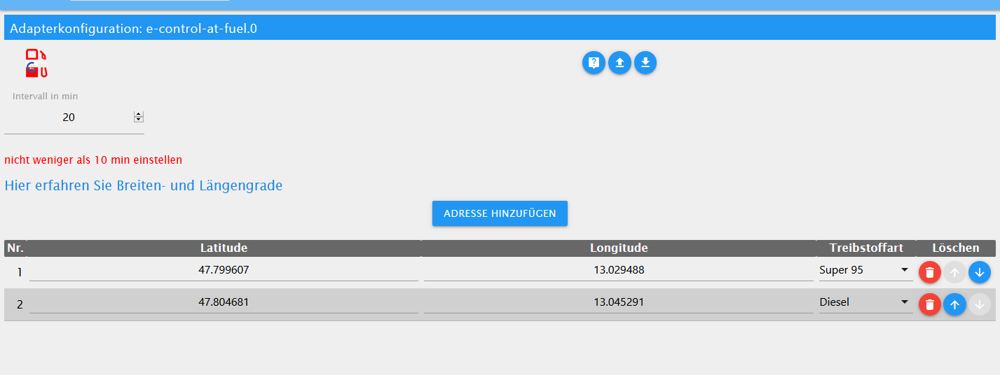
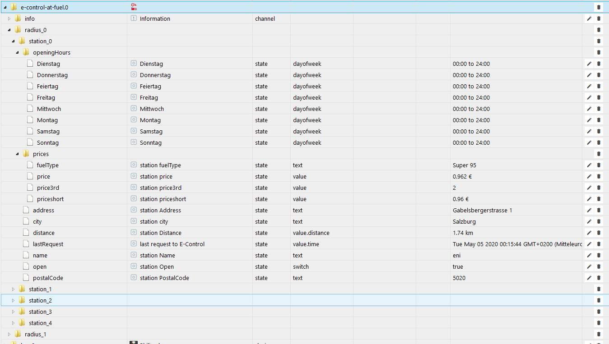
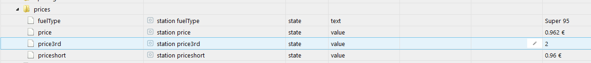
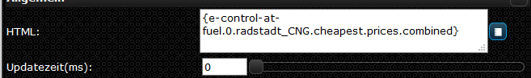

# ioBroker.e-control-at-fuel

[](https://www.npmjs.com/package/iobroker.e-control-at-fuel) 
[](https://www.npmjs.com/package/iobroker.e-control-at-fuel)


 
[](https://david-dm.org/xXBJXx/iobroker.e-control-at-fuel) 
[](https://snyk.io/test/github/xXBJXx/ioBroker.e-control-at-fuel) 

[](https://nodei.co/npm/iobroker.e-control-at-fuel/)

**Tests:**: [](https://travis-ci.org/xXBJXx/ioBroker.e-control-at-fuel)

## E-Control-at-fuel

### Fuel prices for Austria

[Forumbeitrag](https://forum.iobroker.net/topic/33033/e-control-at-fuel-kraftstoffpreise-f%C3%BCr-%C3%B6sterreich)

## Der Adapter liest die Spritpreise von E-Control.at aus:



Auf der config Seite muss man nur den Intervall **(die kleineste einstellbare Zeit ist 10 min)** setzen und die Latitude und Longitude eintragen diese könnt ihr hier nach schauen **https://www.latlong.net/** dann wählt man nur noch aus welchem Sprit man will und fertig.
sobald der Adapter startet wird ein Ordner für jede spalte, die auf der config Seite angelegt wurde, ein Ordner mit dem Stadtnamen und der Sprit Art z.B. **rosenheim_diesel** angelegt und in diese werden dann die Tankstellen Ordner angelegt die Anzahl hängt von den Tankstellen ab die ihre preis übermitteln des weiteren werden 2 Ordner angelegt die die billigsten und den teuerste Tankstellen angelegt und eine JSON Tabelle für alle Tankstellen die im Ordner angelegt wurden.



Der Preis ist in 3 verschiedene Angaben geteilt einmal der normale preis z.B. **0.962€** beim 2ten wurde die **2** entfernt **0.96€** bei dieser Variante kann man mit Hilfe von CSS und Bindings in der vis die entfernte **2** in klein anzeigen lasen z.B. so **0.96²€** und der 3te ist die entfernte **2**.
der state combined ist ein html code, der den priceshort und price3rd verbindet zu z.B. 0.93³€ dieser kann in der vis in html Widget genutzt werden.





Ich empfehle damit Bindings zu arbeiten so z.B. **{e-control-at-fuel.0.radstadt_CNG.cheapest.prices.combined}** der Wert wird dann automatisch aktualisiert
dem html wird eine CSS class mitgegeben hier noch die passende CSS:

```

.station_open {
    color: blue;
}

.station_closed {
    color: red !important; /* !important kann ggf. weggelassen werden */
}

/* € sign */
.station_combined_euro {
    font-family: Times;
    font-size: 80%;
}

```

_____________________

## To-Do

* [ ] Tankstellen Logos

* [x] Ausgabe der DP als JSON /Table

* [x] Ein DP billigste/teuerste Tankstelle

____________________________

## Changelog

### 0.1.0

* (xXBJXx) Latest Release

### 0.0.8

* (xXBJXx) added new stations + logos
* (xXBJXx) new state prices.combined

### 0.0.7

* (xXBJXx) fixed name bug and added new stations + logos

### 0.0.6

* (xXBJXx) added Gas station logos in svg and png format

### 0.0.5

* (xXBJXx) Json table adjusted and all stations in one Dp

### 0.0.4

* (xXBJXx) cheapest / most expensive gas station

* (xXBJXx) Added DP output as JSON

* (xXBJXx) added Gas station logos

### 0.0.3

* (xXBJXx) City and fuel type added as a designation

### 0.0.2

* (xXBJXx) beta release

### 0.0.1

* (xXBJXx) initial release

## License

MIT License

Copyright (c) 2020 xXBJXx <alienware.games@gmail.com>

Permission is hereby granted, free of charge, to any person obtaining a copy
of this software and associated documentation files (the "Software"), to deal
in the Software without restriction, including without limitation the rights
to use, copy, modify, merge, publish, distribute, sublicense, and/or sell
copies of the Software, and to permit persons to whom the Software is
furnished to do so, subject to the following conditions:

The above copyright notice and this permission notice shall be included in all
copies or substantial portions of the Software.

THE SOFTWARE IS PROVIDED "AS IS", WITHOUT WARRANTY OF ANY KIND, EXPRESS OR
IMPLIED, INCLUDING BUT NOT LIMITED TO THE WARRANTIES OF MERCHANTABILITY,
FITNESS FOR A PARTICULAR PURPOSE AND NONINFRINGEMENT. IN NO EVENT SHALL THE
AUTHORS OR COPYRIGHT HOLDERS BE LIABLE FOR ANY CLAIM, DAMAGES OR OTHER
LIABILITY, WHETHER IN AN ACTION OF CONTRACT, TORT OR OTHERWISE, ARISING FROM,
OUT OF OR IN CONNECTION WITH THE SOFTWARE OR THE USE OR OTHER DEALINGS IN THE
SOFTWARE.
